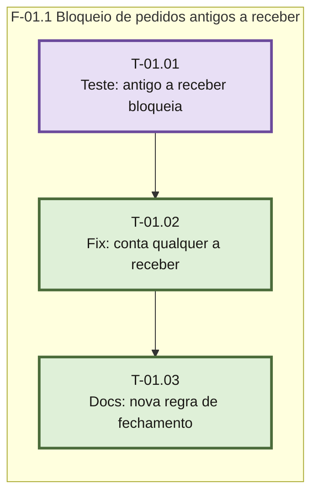

> Frontmatter obrigatorio (expx-schema v1). Este arquivo e o plano condensado da unica sprint.

# Plano — Sprint 01 — Fechamento do caixa bloqueia qualquer pedido a receber

## Objetivo da sprint

O fechamento do caixa passa a bloquear com QUALQUER pedido a receber, inclusive de dias anteriores (hoje só bloqueia pedidos do turno), mantendo o resumo da tela como está, com teste de regressão vermelho antes do fix, e com todos os documentos da regra atualizados.

## Critério de saída da sprint

`npm test`, `npm run check`, `npm run test:ci` e `npm run test:integracao` somam 0 falhas e os docs não citam a regra antiga.

## Riscos conhecidos

- Dublê de `test/caixa-trava.test.js` devolve linhas vazias para qualquer query de pedidos: se `fecharCaixa` fosse exercitado ali, a contagem nova retornaria 0 (não falsa bloqueio). A suíte integração real é a prova de verdade.

## Fora de escopo

- Inverter o resumo da tela (aviso de antigos vira lista fundida) — a tela não muda.
- Refatorar `_contarAReceber` compartilhada — a nova função é aditivo.
- Melhorar a mensagem de bloqueio — copy permanece.

## Fase F-01.1 — Bloqueio de pedidos antigos a receber

**Objetivo:** caixa não fecha com pedido a receber de qualquer data, sem regressão na tela.

**Tasks:** T-01.01, T-01.02, T-01.03

**Critério de saída:** caixa não fecha com pedido a receber de qualquer data, teste de regressão invertido verde e docs da regra atualizados.

**Roda em paralelo com:** nenhuma.

### Grafo de tasks



## Tasks

---

```yaml
id: T-01.01
titulo: Teste - antigo a receber bloqueia fechamento
objetivo: Inverter o teste de integracao que hoje assevera que pedido antigo nao bloqueia o caixa, para exigir 400
arquivos:
  cria: []
  altera: [test/integracao/caixa.test.js]
teste_regressao: POST /api/caixa/fechar com pedido a receber com criado_em de 2 dias atras e caixa novo aberto deve devolver 400 com erro /a receber/i e hoje devolve 200
teste_integracao: roda a suite integracao de caixa e vizinhanca (caixa.test.js e mesas.test.js compartilham turno) com o teste invertido falhando em 200 e o resto verde
teste_funcional: chamada REST ao servidor de integracao: fechar com pedido antigo a receber -> 400; fechar valido sem a receber -> 200
criterio_aceite: o teste invertido falha (recebe 200, nao 400) com a suite nova antes do fix, e o restante da suite continua verde
depende_de: []
paralelizavel: false
status: pendente
```

---

```yaml
id: T-01.02
titulo: Fix - fechamento conta qualquer pedido a receber
objetivo: Criar _contarAReceberTotal (sem limite de criado_em) e usa-la no gate do fechamento; atualizar o comentario da decisao em src/caixa.js
arquivos:
  cria: []
  altera: [src/caixa.js]
teste_integracao: suite integracao caixa + mesas fica verde com o teste invertido de T-01.01
teste_funcional: POST /api/caixa/fechar com pedido a receber antigo -> 400; sem pedido a receber -> 200; resumo da tela segue sem mudanca
criterio_aceite: o teste invertido de T-01.01 passa e a suite inteira de caixa e mesas nao regride
depende_de: [T-01.01]
paralelizavel: false
status: pendente
```

---

```yaml
id: T-01.03
titulo: Docs - nova regra de fechamento
objetivo: Atualizar docs/planos-e-frete.md, docs/arquitetura.md, docs/modelo-dados.md, PRD.md e CLAUDE.md para a nova regra e fechar a decisao aberta no PROGRESSO.md
arquivos:
  cria: []
  altera: [docs/planos-e-frete.md, docs/arquitetura.md, docs/modelo-dados.md, PRD.md, CLAUDE.md, PROGRESSO.md]
teste_integracao: rg por "pedido a receber" em docs/ nao aponta trecho com a regra antiga
teste_funcional: leitura dos trechos reescritos confirma que antigos a receber bloqueiam o fechamento e que o resumo mantem aviso
criterio_aceite: nenhuma mencao a regra antiga em CLAUDE.md e docs/; PROGRESSO.md registra a ocorrencia concluida
depende_de: [T-01.02]
paralelizavel: false
status: concluida
```