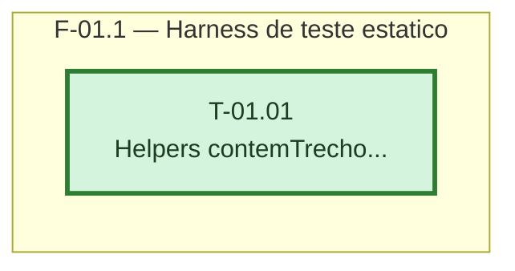

# Fases — Sprint 01

---

## F-01.1 — Harness de teste estático

**Objetivo:** Criar os helpers `contemTrecho` e `trechoEntre` que os testes das 12 tasks da
sprint-02 vão usar
para confirmar presença de atributo/valor no arquivo-fonte.

**Tasks que a compõem:** T-01.01

**Critério de saída:** `node --test test/arquivo-estatico.test.js` termina com 0 failed.

**Roda em paralelo com:** nenhuma
