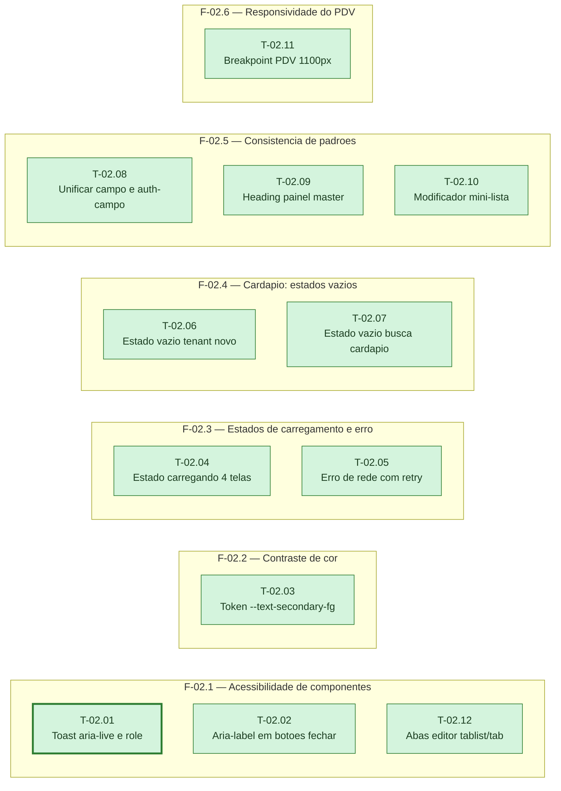

# Fases — Sprint 02

<!-- Nenhuma das 12 tasks desta sprint declara depende_de: todas têm depende_de: []. A
     dependência do helper de teste (T-01.01, sprint-01) é estrutural, garantida pela ordem das
     sprints, não uma dependência funcional entre tasks — por isso o grafo abaixo não tem
     nenhuma aresta. O paralelismo real entre as tasks é limitado pelos arquivos que cada uma
     altera (a maioria toca public/app.js, public/admin.html ou public/style.css, que se
     repetem entre fases); por isso quase todas as fases foram declaradas sequenciais por
     decisão de plano. Exceção: T-02.09 (fase F-02.5) é paralelizavel: true, por não conflitar
     com nenhum arquivo de outra task (achado MÉDIA da F5, 00-AUDITORIA.md). -->

> Um bloco por fase. O paralelismo declarado aqui é definitivo: a execução nunca decide
> paralelismo sozinha. Todas as fases desta sprint foram declaradas sequenciais por decisão de
> plano — a maioria das tasks toca os mesmos três arquivos (`public/app.js`,
> `public/admin.html`, `public/style.css`), então rodar fases em paralelo arriscaria duas tasks
> escrevendo no mesmo arquivo ao mesmo tempo.

---

## F-02.1 — Acessibilidade de componentes

**Objetivo:** Corrigir os achados Alto #1 (toast sem `aria-live`), Alto #2 (botões `✕` sem
`aria-label`, incluindo o 4º botão de D-09) e Baixo #1 (abas do editor sem `role` ARIA).

**Tasks que a compõem:** T-02.01, T-02.02, T-02.12

**Critério de saída:** Os 3 testes estáticos correspondentes passam.

**Roda em paralelo com:** nenhuma

---

## F-02.2 — Contraste de cor

**Objetivo:** Corrigir o achado Alto #3 (`--text-secondary` sobre `--bg-overlay` abaixo do
mínimo AA), criando o token `--text-secondary-fg`.

**Tasks que a compõem:** T-02.03

**Critério de saída:** O teste estático passa.

**Roda em paralelo com:** nenhuma

---

## F-02.3 — Estados de carregamento e erro

**Objetivo:** Corrigir os achados Alto #4 (sem indicador de carregando em 4 telas) e Alto #5
(erro de rede confundido com "caixa fechado" no PDV e em Mesas).

**Tasks que a compõem:** T-02.04, T-02.05

**Critério de saída:** Os 2 testes estáticos passam.

**Roda em paralelo com:** nenhuma

---

## F-02.4 — Cardápio: estados vazios

**Objetivo:** Corrigir os achados Alto #6 (tenant novo sem estado vazio) e Médio #3 (busca sem
resultado fora do padrão `.estado-vazio`).

**Tasks que a compõem:** T-02.06, T-02.07

**Critério de saída:** Os 2 testes estáticos passam.

**Roda em paralelo com:** nenhuma

---

## F-02.5 — Consistência de padrões

**Objetivo:** Corrigir os achados Médio #1 (`.campo`/`.auth-campo` duplicados), Médio #2
(heading duplicado no painel master) e Médio #4 (`button.mini` abaixo da altura de toque).

**Tasks que a compõem:** T-02.08, T-02.09, T-02.10

**Critério de saída:** Os 3 testes estáticos passam.

**Roda em paralelo com:** nenhuma

---

## F-02.6 — Responsividade do PDV

**Objetivo:** Corrigir o achado Médio #5 (breakpoint do PDV descasado do da sidebar).

**Tasks que a compõem:** T-02.11

**Critério de saída:** O teste estático passa.

**Roda em paralelo com:** nenhuma
