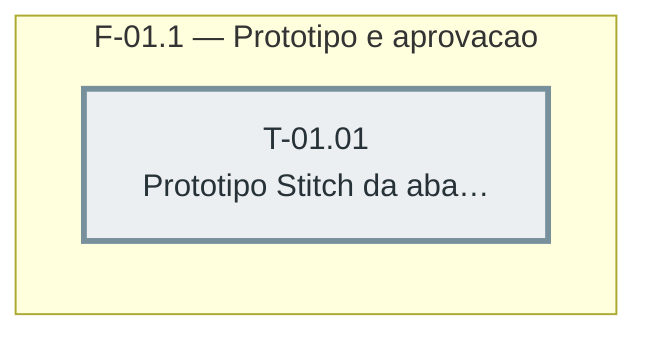

> Sprint com uma task só: ela sozinha é o caminho crítico da sprint.

---

## F-01.1 — Protótipo e aprovação

**Objetivo:** Gerar o protótipo da aba "Relatórios" (com o extrato geral de estoque como
conteúdo) via Google Stitch, semeado com os tokens reais de `public/style.css`, e obter
aprovação explícita do dono antes de qualquer task de UI das sprints seguintes.

**Tasks que a compõem:** T-01.01

**Critério de saída:** Aprovação explícita do dono registrada (prosa) na task, protótipo
reaproveita o design system já semeado no projeto (`assets/6506830711685967852`, "Nymbus
Pedidos", per `CLAUDE.md`).

**Roda em paralelo com:** F-02.1 (backend não toca UI, não depende do protótipo aprovado)
