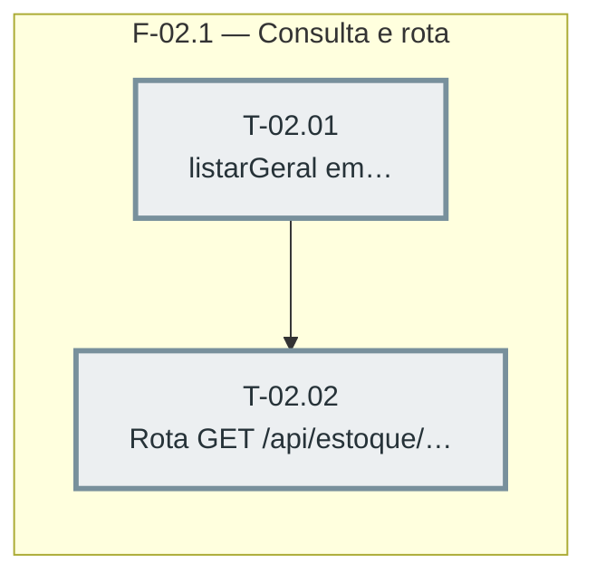

---

## F-02.1 — Consulta e rota

**Objetivo:** Criar a função de consulta geral em `src/estoque-db.js` e a rota HTTP que a
expõe, com os mesmos gates de plano/permissão da rota de produto único.

**Tasks que a compõem:** T-02.01, T-02.02

**Critério de saída:** Rota `GET /api/estoque/geral` devolve movimentos de todos os produtos,
paginados por cursor, filtráveis por `tipos` (lista) e `desde`/`ate` (opcionais); suíte verde.

**Roda em paralelo com:** F-01.1 (esta fase não toca UI, não depende do protótipo aprovado)
