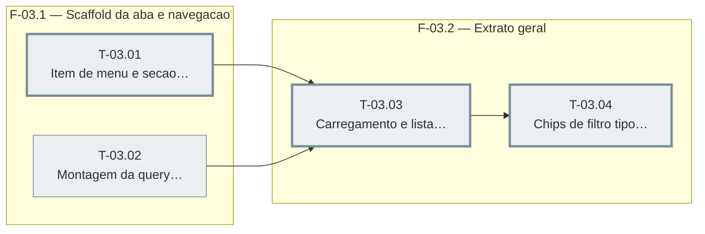

> `T-03.01` e `T-03.02` também dependem de `T-01.01` (Sprint 01) e não aparecem aqui por
> serem de outra sprint — não é aresta omitida por engano. `T-03.03` também depende de
> `T-02.02` (Sprint 02), pelo mesmo motivo.

---

## F-03.1 — Scaffold da aba e navegação

**Objetivo:** Criar o item de menu "Relatórios" e a seção da tela, com o mesmo padrão de
bloqueio de Plano Completo já usado em Controle de estoque (D-09), e a função pura que monta
a query string dos filtros.

**Tasks que a compõem:** T-03.01, T-03.02

**Critério de saída:** Item de menu existe, seção renderiza o estado de bloqueio quando sem
Plano Completo, e a função de montagem de query tem cobertura de teste.

**Roda em paralelo com:** nenhuma

---

## F-03.2 — Extrato geral: lista, filtros, paginação

**Objetivo:** Carregar e renderizar a lista de movimentos com paginação por cursor, e ligar os
filtros de tipo (multi-seleção) e período (presets + customizado) ao carregamento.

**Tasks que a compõem:** T-03.03, T-03.04

**Critério de saída:** Lista carrega, "Carregar mais" nunca repete/pula linha, filtros
recarregam a lista do zero ao mudar.

**Roda em paralelo com:** nenhuma
