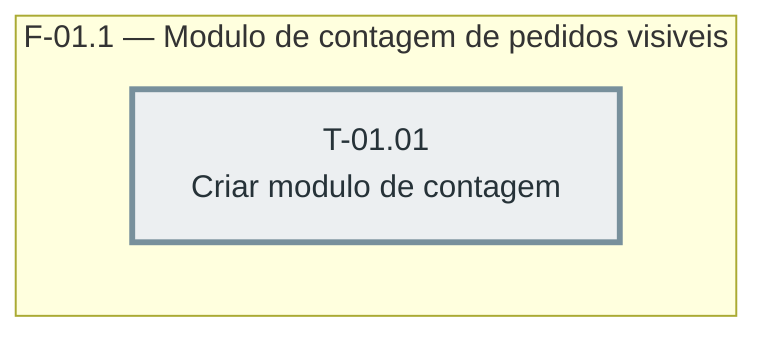

# Fases — Sprint 01

---

## F-01.1 — Módulo de contagem de pedidos visíveis

**Objetivo:** Criar o arquivo dual-mode com a conta pura de quantos pedidos mostrar, testável com `node:test`.

**Tasks que a compõem:** T-01.01

**Critério de saída:** `node --test test/paginacao-pedidos.test.js` termina com 0 failed.

**Roda em paralelo com:** nenhuma
