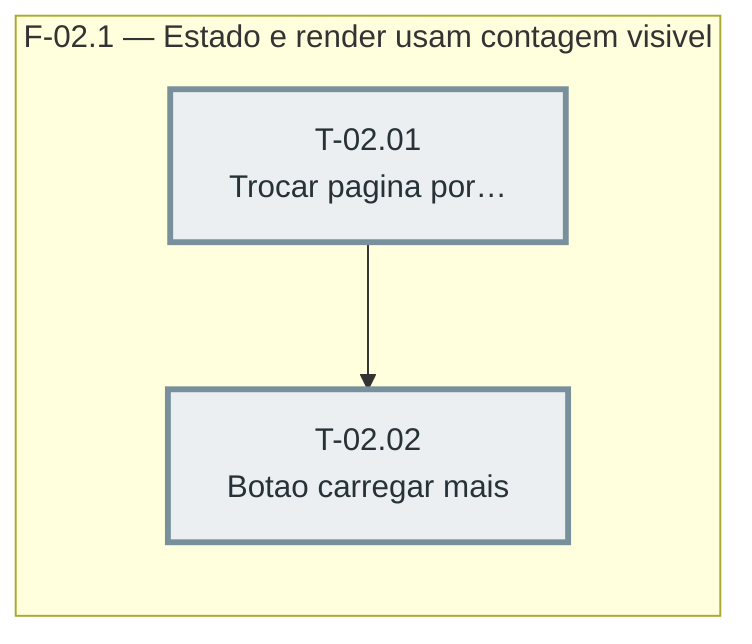

# Fases — Sprint 02

---

## F-02.1 — Estado e render usam contagem visível em vez de página numerada

**Objetivo:** Trocar o mecanismo de paginação numerada por uma contagem visível crescente, com um único botão "Carregar mais".

**Tasks que a compõem:** T-02.01, T-02.02

**Critério de saída:** `npm test` termina com 0 failed e `npm run check` sem erro de sintaxe.

**Roda em paralelo com:** nenhuma
