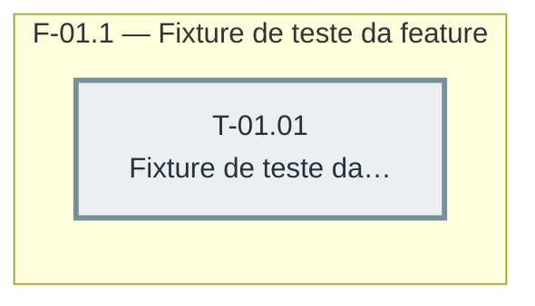

# Fases — Sprint 01

> Caminho crítico: T-01.01 (única task da sprint).

---

## F-01.1 — Fixture de teste da feature

**Objetivo:** Preparar a empresa/cardápio/caixa de teste que as demais sprints da feature vão reusar.

**Tasks que a compõem:** T-01.01

**Critério de saída:** `test/integracao/pedidos-comanda.test.js` existe e roda com pelo menos 1 teste verde.

**Roda em paralelo com:** nenhuma
