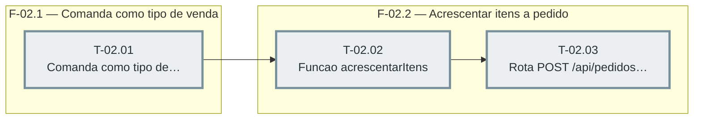

# Fases — Sprint 02

> Caminho crítico: T-02.01 → T-02.02 → T-02.03 (3 tasks; a sprint inteira é uma cadeia única). Correção da F5: T-02.01 e T-02.03 alteram o mesmo `src/servidor.js`, então F-02.1 e F-02.2 deixaram de ser declaradas paralelas — T-02.02 agora depende também de T-02.01.

---

## F-02.1 — Comanda como tipo de venda válido

**Objetivo:** Fazer `/api/pdv/vender` aceitar o novo tipo "Comanda" pelo mesmo caminho de Entrega/Retirada, sem emitir cupom na abertura.

**Tasks que a compõem:** T-02.01

**Critério de saída:** Pedido `tipoEntrega:"Comanda"` nasce `recebido_em: null`, `origem: "pdv"`, sem movimento de caixa e sem via de cupom na fila.

**Roda em paralelo com:** nenhuma

---

## F-02.2 — Acrescentar itens a pedido aberto

**Objetivo:** Criar a função de persistência e a rota HTTP que acrescentam itens a um pedido a receber já existente, seguindo o padrão de `mesasDb.lancarItens`.

**Tasks que a compõem:** T-02.02, T-02.03

**Critério de saída:** `POST /api/pedidos/:id/itens` soma itens/total, baixa estoque atomicamente e enfileira a via de cozinha só da rodada nova.

**Roda em paralelo com:** nenhuma
