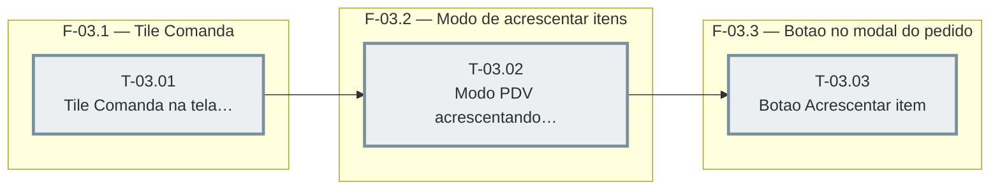

# Fases — Sprint 03

> Caminho crítico: T-03.01 → T-03.02 → T-03.03 (também depende de T-02.01/T-02.03, da sprint-02) — a sprint inteira é uma cadeia única (mesmo arquivo, `public/app.js`, sequenciado de propósito).

---

## F-03.1 — Tile Comanda na tela de cobrança

**Objetivo:** Adicionar "Comanda" aos tipos de venda do PDV, com o mesmo comportamento de Entrega/Retirada.

**Tasks que a compõem:** T-03.01

**Critério de saída:** Harness confirma o tile e a ausência do bloco de pagamento quando o tipo é Comanda.

**Roda em paralelo com:** nenhuma

---

## F-03.2 — Modo PDV de acrescentar itens a Comanda existente

**Objetivo:** Dar ao PDV um modo de lançamento (espelhando `mesaModoId`) que acrescenta itens a um pedido já aberto em vez de criar um novo.

**Tasks que a compõem:** T-03.02

**Critério de saída:** Com `pedidoModoId` setado, confirmar o carrinho chama `POST /api/pedidos/:id/itens`.

**Roda em paralelo com:** nenhuma

---

## F-03.3 — Botão Acrescentar item no modal do pedido

**Objetivo:** Expor a entrada para o modo da F-03.2 a partir do modal de detalhe do pedido, na aba Pedidos.

**Tasks que a compõem:** T-03.03

**Critério de saída:** Botão "Acrescentar item" visível só quando `podeModificar`, e aciona o modo com o pedido correto.

**Roda em paralelo com:** nenhuma
