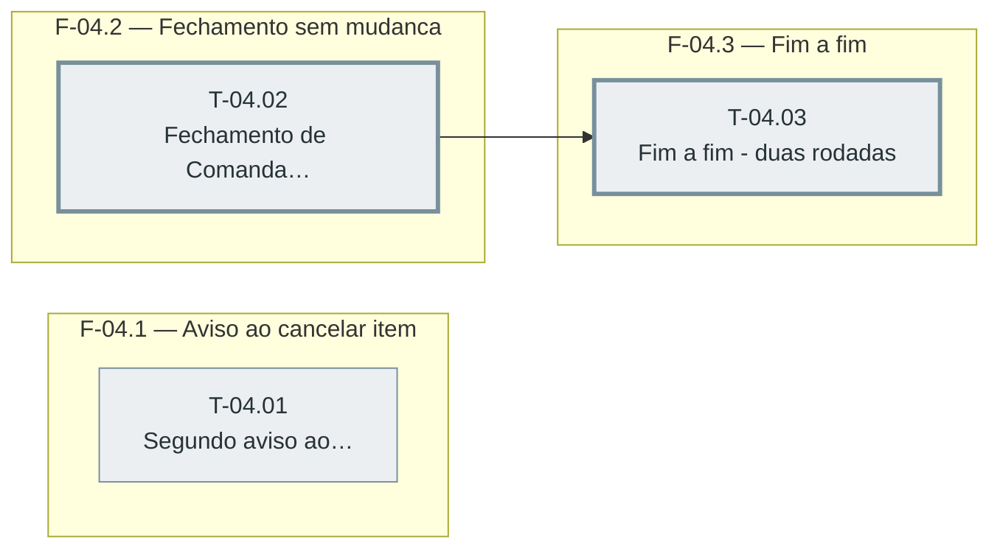

# Fases — Sprint 04

> Caminho crítico DESTA sprint: T-04.02 → T-04.03 (2 tasks; T-04.03 também depende de T-02.03, da sprint-02). **Correção da F5**: T-04.01 agora depende de T-03.03 (sprint-03) porque ambas alteram `public/app.js` — essa aresta é cross-sprint e não aparece no diagrama desta sprint (só nas fases/tasks daqui), mas torna T-04.01 mais longa que o resto da sprint no caminho crítico do FEATURE inteiro (ver `ORQUESTRADOR.md`).

---

## F-04.1 — Aviso ao cancelar item de cozinha

**Objetivo:** Adicionar um segundo aviso específico ao cancelar um item já enviado à cozinha (D-08), preservando o `confirmarComOpcao` que já existe hoje para qualquer item.

**Tasks que a compõem:** T-04.01

**Critério de saída:** Item `cozinha:true` dispara os dois diálogos; item sem `cozinha:true` fica igual a hoje.

**Roda em paralelo com:** F-04.2 (nenhuma depende da outra; F-04.1 também depende de T-03.03, da sprint-03, o que atrasa quando pode começar, mas não impede o paralelismo com F-04.2 quando ambas estiverem liberadas)

---

## F-04.2 — Fechamento via Receber pagamento sem mudança de código

**Objetivo:** Provar que a Comanda fecha pelo botão/rota "Receber pagamento" já existentes, sem regressão.

**Tasks que a compõem:** T-04.02

**Critério de saída:** Pagamento exato fecha a Comanda; pagamento divergente retorna 400, igual a Entrega/Retirada.

**Roda em paralelo com:** F-04.1 (nenhuma depende da outra diretamente, mesmo que F-04.2 dependa da sprint-02 e F-04.1 dependa da sprint-03)

---

## F-04.3 — Fim a fim — Comanda com duas rodadas

**Objetivo:** Validar o fluxo completo da feature num teste único, cobrindo os 4 critérios de pronto (D-13).

**Tasks que a compõem:** T-04.03

**Critério de saída:** Total final e via de cozinha da 2ª rodada corretos.

**Roda em paralelo com:** nenhuma
