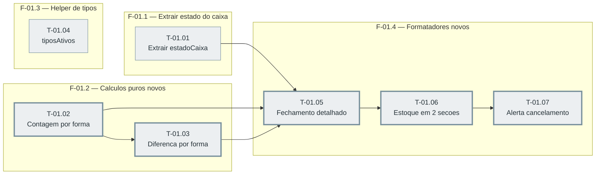

# Fases — Sprint 01

> Caminho crítico: T-01.02→T-01.03→T-01.05→T-01.06→T-01.07 (5 tasks). F-01.1 e F-01.3 terminam
> bem antes e não apertam o calendário.

---

## F-01.1 — Extrair fórmula de estado do caixa

**Objetivo:** Tirar a lógica de CONFERIDO/SOBROU/FALTOU do meio de `montarRelatorioFechamento` e torná-la reutilizável.

**Tasks que a compõem:** T-01.01

**Critério de saída:** `estadoCaixa` exportado, cupom físico produz exatamente o mesmo texto de antes.

**Roda em paralelo com:** F-01.2, F-01.3

---

## F-01.2 — Novos cálculos puros (caixa-calc.js)

**Objetivo:** Fechar as duas lacunas de dado que faltavam (quantidade por forma, diferença por forma).

**Tasks que a compõem:** T-01.02, T-01.03

**Critério de saída:** As duas funções existem, com teste cobrindo caso vazio e caso normal.

**Roda em paralelo com:** F-01.1, F-01.3

---

## F-01.3 — Helper de configuração de tipos

**Objetivo:** Ponto único de leitura de `config.telegram.tipos`, com os defaults certos.

**Tasks que a compõem:** T-01.04

**Critério de saída:** `tiposAtivos` nunca lança e aplica os defaults de D-03.

**Roda em paralelo com:** F-01.1, F-01.2

---

## F-01.4 — Formatadores de mensagem reformulados

**Objetivo:** Os três formatadores (fechamento, estoque, cancelamento) prontos para os hooks de negócio da sprint 03.

**Tasks que a compõem:** T-01.05, T-01.06, T-01.07

**Critério de saída:** Os três existem, testados, sem chamada de rede.

**Roda em paralelo com:** nenhuma
