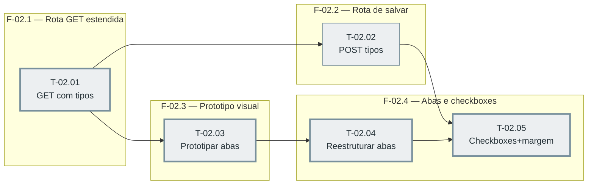

# Fases — Sprint 02

> `T-02.02` corre em paralelo com `T-02.03` (ambas só dependem de `T-02.01`, sem depender uma da
> outra). O caminho crítico é T-02.01→T-02.03→T-02.04→T-02.05 (4 tasks) — a mesma extensão de
> T-02.01→T-02.02→T-02.05, mas passar pelo protótipo/abas é o que trava a UI, então essa é a
> cadeia real.

---

## F-02.1 — Rota GET estendida

**Objetivo:** Base de dados que a UI (T-02.03 em diante) e a rota de salvar (T-02.02) precisam.

**Tasks que a compõem:** T-02.01

**Critério de saída:** GET reflete `tiposAtivos` e `ultimoEnvio` por tipo.

**Roda em paralelo com:** nenhuma

---

## F-02.2 — Rota de salvar tipos e margem

**Objetivo:** Persistir a escolha do operador sem apagar o resto do config do tenant.

**Tasks que a compõem:** T-02.02

**Critério de saída:** POST grava e preserva, com teste de fixture "tenant frio".

**Roda em paralelo com:** F-02.3

---

## F-02.3 — Protótipo visual (portão obrigatório)

**Objetivo:** Desenhar as duas abas antes de qualquer código de interface.

**Tasks que a compõem:** T-02.03

**Critério de saída:** Protótipo aprovado explicitamente.

**Roda em paralelo com:** F-02.2

---

## F-02.4 — Implementar abas e checkboxes

**Objetivo:** Levar o protótipo aprovado a código de verdade, ligado às rotas de F-02.1/F-02.2.

**Tasks que a compõem:** T-02.04, T-02.05

**Critério de saída:** Abas alternam corretamente; checkboxes e margem salvam e refletem o status por tipo.

**Roda em paralelo com:** nenhuma
