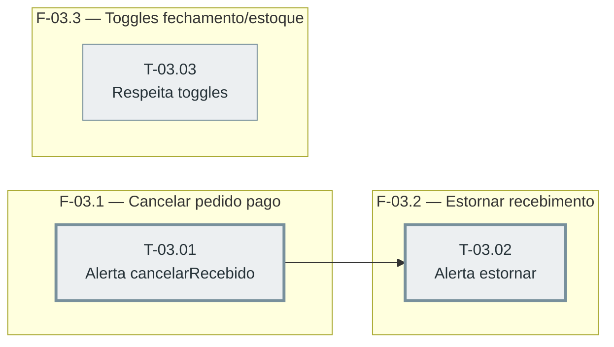

# Fases — Sprint 03

> `T-03.03` não depende de `T-03.01`/`T-03.02` dentro desta sprint (suas dependências reais são
> de sprint-01) — corre solto no diagrama, mas na prática dois testes tocam o mesmo arquivo
> (`src/caixa.js`), então a ordem de execução real é sequencial (a fase não declara paralelismo).
> Caminho crítico local: T-03.01→T-03.02 (2 tasks).

---

## F-03.1 — Disparo do alerta em cancelarRecebido

**Objetivo:** Primeiro dos dois pontos de cancelamento em escopo (D-06).

**Tasks que a compõem:** T-03.01

**Critério de saída:** Alerta dispara só quando plano, toggle e margem permitem.

**Roda em paralelo com:** nenhuma

---

## F-03.2 — Disparo do alerta em estornarRecebimento

**Objetivo:** Segundo ponto de cancelamento em escopo (D-06), mesma regra.

**Tasks que a compõem:** T-03.02

**Critério de saída:** Alerta dispara com a mesma regra de T-03.01.

**Roda em paralelo com:** nenhuma

---

## F-03.3 — Fechamento e estoque respeitam seus toggles

**Objetivo:** Fechar a integração dos dois tipos já existentes com o sistema de toggles.

**Tasks que a compõem:** T-03.03

**Critério de saída:** Cada tipo independente; `ultimoEnvio` por tipo.

**Roda em paralelo com:** nenhuma
