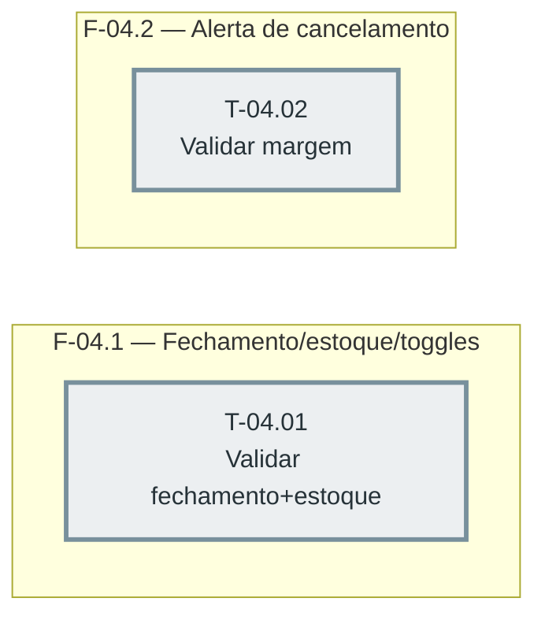

# Fases — Sprint 04

> As duas tasks não dependem uma da outra DENTRO desta sprint (as dependências reais apontam
> para sprint-02/03) — soltas no diagrama, mas ambas fecham a mesma Definição de Pronto (D-10).

---

## F-04.1 — Validar fechamento, estoque e toggles

**Objetivo:** Fechar a parte de fechamento/estoque/toggles da Definição de Pronto.

**Tasks que a compõem:** T-04.01

**Critério de saída:** Mensagens reais confirmadas.

**Roda em paralelo com:** F-04.2

---

## F-04.2 — Validar alerta de cancelamento com margem

**Objetivo:** Fechar a parte de cancelamento da Definição de Pronto.

**Tasks que a compõem:** T-04.02

**Critério de saída:** Margem respeitada, confirmado real.

**Roda em paralelo com:** F-04.1
