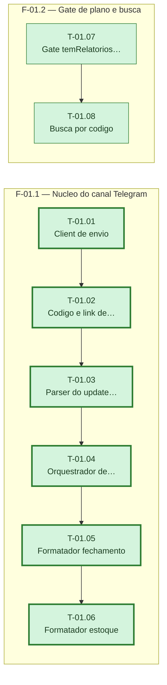

# Fases — Sprint 01

> O caminho critico desta sprint e a cadeia F-01.1 (seis tasks em serie); F-01.2 (duas tasks)
> termina bem antes e roda em paralelo, sem apertar o calendario da sprint.

---

## F-01.1 — Nucleo do canal Telegram

**Objetivo:** Construir src/telegram.js com todas as funcoes puras do canal (envio, codigo de vinculacao, parsing de update, orquestracao de vinculo, formatacao das duas mensagens).

**Tasks que a compõem:** T-01.01, T-01.02, T-01.03, T-01.04, T-01.05, T-01.06

**Critério de saída:** As seis funcoes existem em src/telegram.js e a suite cobre cada uma sem tocar rede real.

**Roda em paralelo com:** F-01.2

---

## F-01.2 — Gate de plano e busca por codigo

**Objetivo:** Estender src/empresas.js com o gate temRelatoriosTelegram e a busca de tenant por codigo de vinculacao.

**Tasks que a compõem:** T-01.07, T-01.08

**Critério de saída:** As duas funcoes existem em src/empresas.js e a suite cobre cada uma stubando db.query.

**Roda em paralelo com:** F-01.1
