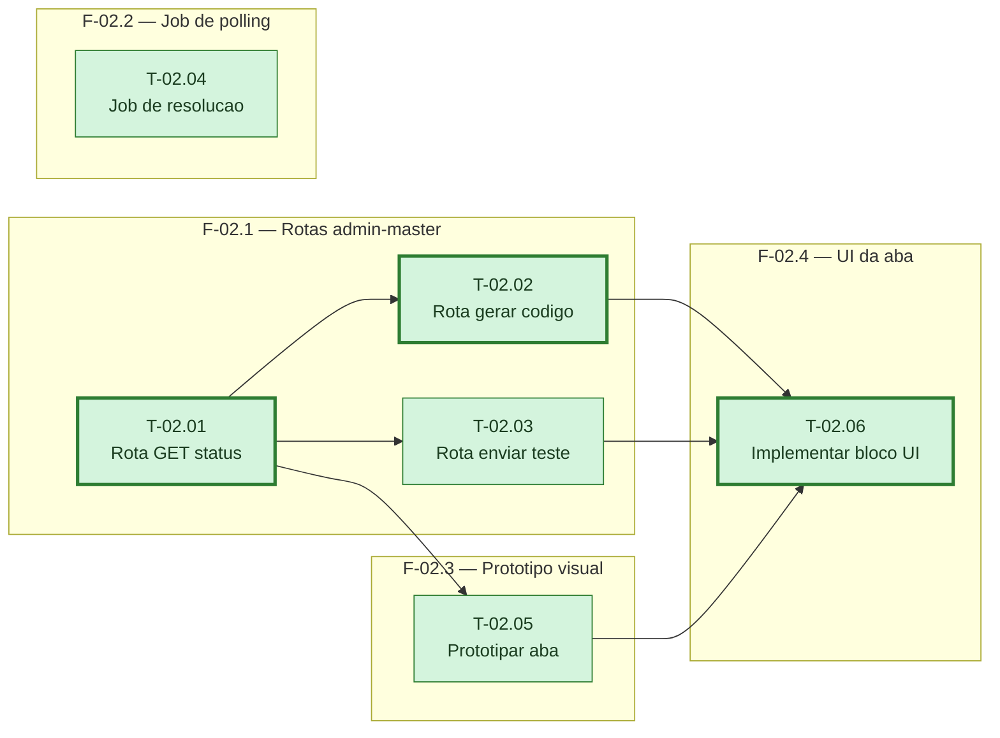

# Fases — Sprint 02

> `T-02.04` (job de polling) nao depende de nenhuma task desta sprint — so de sprint-01 — e por
> isso corre solto no diagrama, em paralelo com tudo. O caminho critico local
> (T-02.01→T-02.02→T-02.06) e um empate de tamanho com T-02.01→T-02.03→T-02.06 e
> T-02.01→T-02.05→T-02.06; marcamos a cadeia via T-02.02 por menor id de desempate na segunda
> posicao (regra do desempate: menor id no ultimo no antes do fim, aqui T-02.02 < T-02.03 < T-02.05
> ja empatam no comprimento, e T-02.02 vence por ordem alfabetica).

---

## F-02.1 — Rotas admin-master de configuração

**Objetivo:** Expor status, geração de código e envio de teste do Telegram de um tenant, tudo sob `exigeSuperAdmin`.

**Tasks que a compõem:** T-02.01, T-02.02, T-02.03

**Critério de saída:** As três rotas existem e respondem conforme os contratos definidos em `tasks.md`.

**Roda em paralelo com:** F-02.2

---

## F-02.2 — Job de resolução de vínculo (polling)

**Objetivo:** Resolver automaticamente o `chat_id` de um tenant quando o dono manda `/start <codigo>` no bot.

**Tasks que a compõem:** T-02.04

**Critério de saída:** O job roda a cada rodada de polling sem derrubar o processo em caso de falha de rede.

**Roda em paralelo com:** F-02.1, F-02.3

---

## F-02.3 — Protótipo visual (portão obrigatório)

**Objetivo:** Desenhar a aba antes de qualquer código de interface, com todos os estados de tela.

**Tasks que a compõem:** T-02.05

**Critério de saída:** Protótipo aprovado explicitamente pelo usuário.

**Roda em paralelo com:** F-02.2

---

## F-02.4 — UI da aba no admin-master

**Objetivo:** Implementar a aba de verdade em `app-admin.js`, seguindo o protótipo aprovado.

**Tasks que a compõem:** T-02.06

**Critério de saída:** Aba funcional no modal do tenant, chamando as três rotas de F-02.1.

**Roda em paralelo com:** nenhuma
