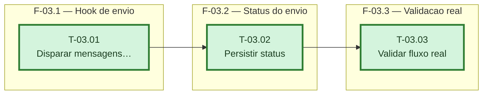

# Fases — Sprint 03

> Sprint inteira e uma cadeia unica (sem paralelismo) — a informacao "nao ha nada em paralelo
> aqui" e o proprio resultado, e o caminho critico e a sprint inteira.

---

## F-03.1 — Hook de envio no fechamento de caixa

**Objetivo:** Disparar as duas mensagens no momento em que o caixa fecha, gated por plano e vínculo.

**Tasks que a compõem:** T-03.01

**Critério de saída:** `fecharCaixa` chama `telegram.enviar` duas vezes quando as condições batem, zero vezes quando não.

**Roda em paralelo com:** nenhuma

---

## F-03.2 — Registro do status do último envio

**Objetivo:** Persistir sucesso/falha do envio para o admin-master exibir.

**Tasks que a compõem:** T-03.02

**Critério de saída:** `config.telegram.ultimoEnvio` reflete o resultado real.

**Roda em paralelo com:** nenhuma

---

## F-03.3 — Validação ponta a ponta (Telegram real)

**Objetivo:** Fechar a Definição de Pronto (D-13) com um teste real, não só suíte automatizada.

**Tasks que a compõem:** T-03.03

**Critério de saída:** Mensagens reais confirmadas no Telegram do dono de teste.

**Roda em paralelo com:** nenhuma
